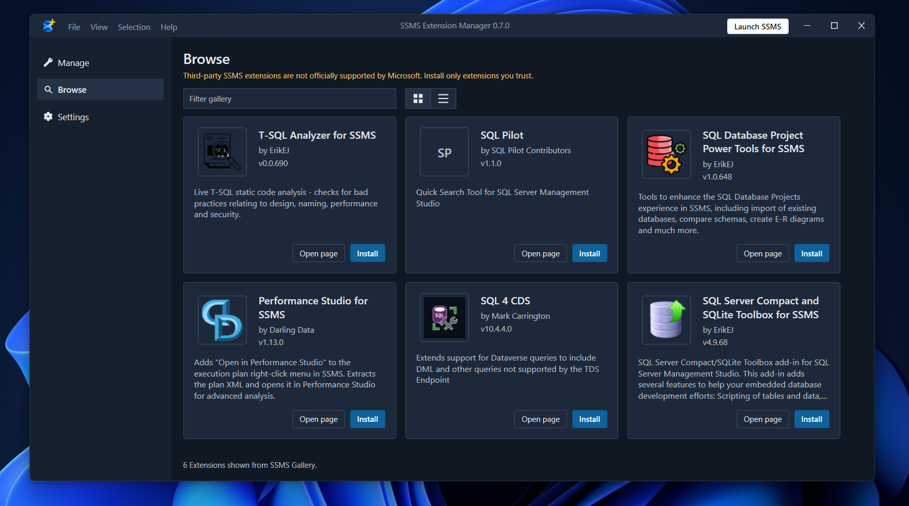

#  SSMS Extension Manager

Manage third-party SSMS 22+ extensions without digging through extension folders, VSIX manifests, or release pages.

## What It Does

- Finds SSMS 22+ installations and scans installed extensions.
- Shows installed version, latest version, publisher, scope, and update source.
- Installs a local `.vsix` or a `.zip` that contains one `.vsix`.
- Updates extensions from GitHub releases or direct downloadable `.vsix`/`.zip` links.
- Reinstalls managed extensions from the local cache after uninstall.
- Removes uninstalled extensions from the list when you no longer want to track them.

## Why Use It

SSMS does not make third-party extension management especially friendly. This app gives you one place to:

- see what is installed
- check whether updates exist
- install or reinstall extensions
- keep user-supplied update sources attached to each extension

## Important Caveat

Microsoft does not officially support third-party SSMS extensions. This app verifies VSIX identity before updating so it does not blindly install a mismatched package.

## Get It

Download the latest `SsmsExtensionManager-win-Setup.exe` from [GitHub Releases](https://github.com/Blake-goofy/ssms-extension-manager/releases/latest).

## Technical Docs

Developer and release notes live in [docs/technical-README.md](docs/technical-README.md).
